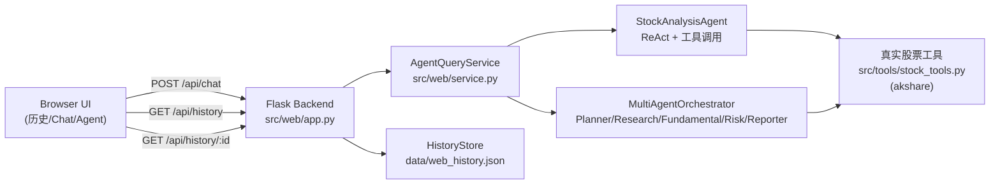

# 前后端结构说明

```mermaid
flowchart LR
    U["Browser UI\n(历史/Chat/Agent)"] -->|POST /api/chat| B["Flask Backend\nsrc/web/app.py"]
    U -->|GET /api/history| B
    U -->|GET /api/history/:id| B

    B --> S["AgentQueryService\nsrc/web/service.py"]
    S --> A1["StockAnalysisAgent\nReAct + 工具调用"]
    S --> A2["MultiAgentOrchestrator\nPlanner/Research/Fundamental/Risk/Reporter"]

    B --> H["HistoryStore\ndata/web_history.json"]

    A1 --> T["真实股票工具\nsrc/tools/stock_tools.py\n(akshare)"]
    A2 --> T
```

