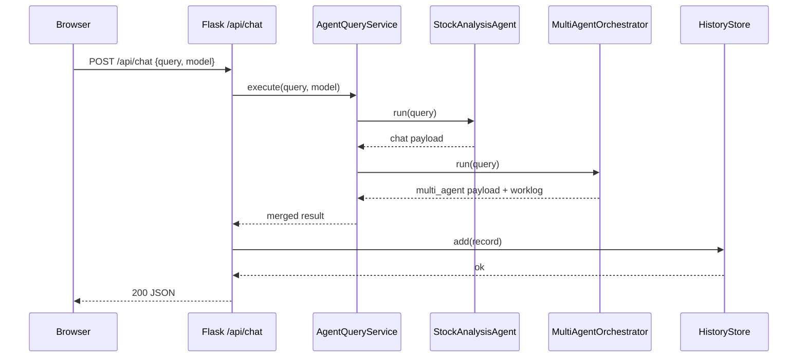
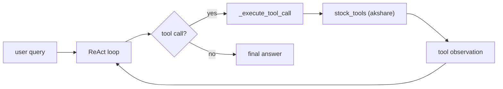
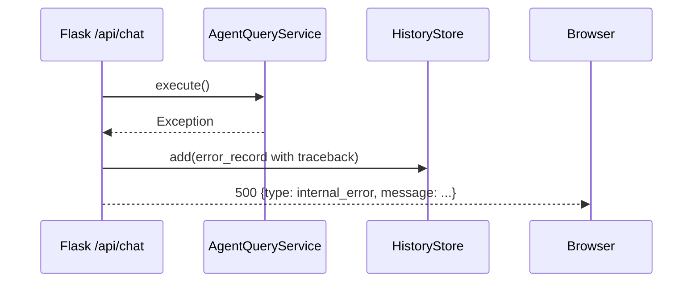

# Dataflow

## Scenario A: Web chat happy path

### Steps (confirmed)
1. Browser POST `/api/chat` with `{query, model}` -> `chat()` in [src/web/app.py](/Users/tbxsx/Code/VibeRL/src/web/app.py:68)
2. Input validation (empty/length checks) in [src/web/app.py](/Users/tbxsx/Code/VibeRL/src/web/app.py:77)
3. `service.execute()` in [src/web/service.py](/Users/tbxsx/Code/VibeRL/src/web/service.py:25)
4. Single-agent branch: `StockAnalysisAgent.run()` in [src/agent/core.py](/Users/tbxsx/Code/VibeRL/src/agent/core.py:33)
5. Multi-agent branch: `MultiAgentOrchestrator.run()` in [src/demo/multi_agent_demo.py](/Users/tbxsx/Code/VibeRL/src/demo/multi_agent_demo.py:230)
6. Persist record via `HistoryStore.add()` in [src/web/history_store.py](/Users/tbxsx/Code/VibeRL/src/web/history_store.py:39)
7. Return merged response to frontend.

## Scenario B: Tool call flow in StockAnalysisAgent

### Steps (confirmed)
1. Build initial messages `[system,user]` in [src/agent/core.py](/Users/tbxsx/Code/VibeRL/src/agent/core.py:44)
2. Loop up to `max_steps` in [src/agent/core.py](/Users/tbxsx/Code/VibeRL/src/agent/core.py:50)
3. Decide next action via model/function-calling or rule-based fallback in [src/agent/core.py](/Users/tbxsx/Code/VibeRL/src/agent/core.py:90)
4. Execute tool via `_execute_tool_call()` in [src/agent/core.py](/Users/tbxsx/Code/VibeRL/src/agent/core.py:348)
5. Tool accesses akshare in [src/tools/stock_tools.py](/Users/tbxsx/Code/VibeRL/src/tools/stock_tools.py:261)
6. Append `tool` message and continue until final answer.

## Scenario C: Failure path (internal exception)

### Steps (confirmed)
1. `service.execute()` throws exception in [src/web/app.py](/Users/tbxsx/Code/VibeRL/src/web/app.py:103)
2. Store full internal error record (`type/message/traceback`) in history file.
3. Return sanitized `500` payload (`internal_error`) to client.

## Risks
- 外部行情源抖动会直接影响请求时延和成功率。
- 单次请求串行执行 chat + multi-agent，成本较高（可考虑并行或异步队列）。

## Inferred / runtime verification needed
- 实际生产负载下，`search_stock_by_name` 首次冷启动耗时分布需压测验证。
