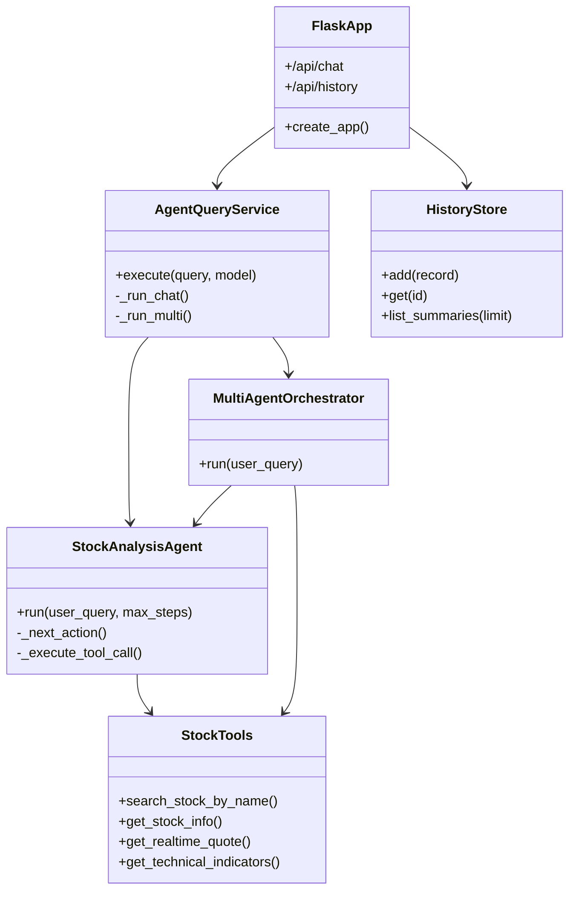

# Key Classes / Modules

## 1) Architecturally load-bearing modules

1. `StockAnalysisAgent` in [src/agent/core.py](/Users/tbxsx/Code/VibeRL/src/agent/core.py:20)
- ReAct 主循环、工具调用决策、轨迹产出。

2. `AgentQueryService` in [src/web/service.py](/Users/tbxsx/Code/VibeRL/src/web/service.py:11)
- Web 聚合层，统一触发单 Agent + 多 Agent。

3. `MultiAgentOrchestrator` in [src/demo/multi_agent_demo.py](/Users/tbxsx/Code/VibeRL/src/demo/multi_agent_demo.py:221)
- 组织 Planner/Research/Fundamental/Risk/Reporter。

4. `HistoryStore` in [src/web/history_store.py](/Users/tbxsx/Code/VibeRL/src/web/history_store.py:10)
- 历史读写与容量控制、损坏文件自愈。

5. `create_app()` in [src/web/app.py](/Users/tbxsx/Code/VibeRL/src/web/app.py:28)
- HTTP 路由、输入校验、错误处理、服务装配。

6. 股票工具模块 in [src/tools/stock_tools.py](/Users/tbxsx/Code/VibeRL/src/tools/stock_tools.py:261)
- 查询/行情/指标计算的领域适配层。

## 2) Diagram

## 3) Extension points
- `AgentQueryService` 支持 `chat_runner`/`multi_runner` 注入（测试替身、灰度策略）。
- `StockAnalysisAgent` 可切换 `model` + `base_url`（在线模型或代理）。
- `HistoryStore` 可替换成 SQLite/Postgres 实现（保持接口不变）。

## 4) Inferred / runtime verification needed
- 若改为多进程部署，`HistoryStore` 接口契约可保持，但实现必须切换为进程安全后端。
