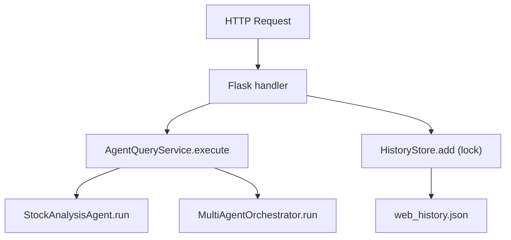

# Thread Model

## Confirmed by code

### 1) Web app (`src/web/app.py`)
- 线程模型：Flask WSGI 请求线程（取决于运行器），代码本身无显式线程池。
- 共享状态：`HistoryStore` 的文件读写由 `threading.Lock` 保护：
  - [src/web/history_store.py](/Users/tbxsx/Code/VibeRL/src/web/history_store.py:14)
  - [src/web/history_store.py](/Users/tbxsx/Code/VibeRL/src/web/history_store.py:40)

### 2) Debug proxy (`src/debugger/proxy.py`)
- 明确存在两个 Flask app：
  - 代理服务（主线程）
  - UI/records 服务（后台线程）
- 线程创建点：
  - [src/debugger/proxy.py](/Users/tbxsx/Code/VibeRL/src/debugger/proxy.py:236)

### 3) Agent execution
- `StockAnalysisAgent.run()` 为同步循环执行，不含 async：
  - [src/agent/core.py](/Users/tbxsx/Code/VibeRL/src/agent/core.py:33)
- `MultiAgentOrchestrator.run()` 同步串行执行每个子 Agent：
  - [src/demo/multi_agent_demo.py](/Users/tbxsx/Code/VibeRL/src/demo/multi_agent_demo.py:230)

## Thread/Task table

| Task | Spawned by | Responsibility | Shared state | Termination |
|---|---|---|---|---|
| Flask request handler (web) | WSGI server | `/api/chat` `/api/history` etc. | `HistoryStore` file | request end |
| HistoryStore lock critical section | same handler | serialize read/write of JSON file | `web_history.json` | lock release |
| Proxy main Flask | `proxy.main()` | forward OpenAI-compatible calls | SQLite DB | process exit |
| Proxy UI Flask (daemon thread) | `threading.Thread` | expose `/records` APIs | SQLite DB | process exit |

## Diagram

## Risks
- 文件存储在高并发下吞吐低，且多进程部署时 `threading.Lock` 无法跨进程同步（高风险扩展性瓶颈）。
- Agent 执行是同步阻塞，外部行情请求慢时会放大 tail latency。
- Proxy/UI 双 Flask 共进程，异常传播与优雅停机策略较弱。

## Inferred / runtime verification needed
- 当前是否以多进程 WSGI 运行（gunicorn workers > 1）需要部署态确认。
